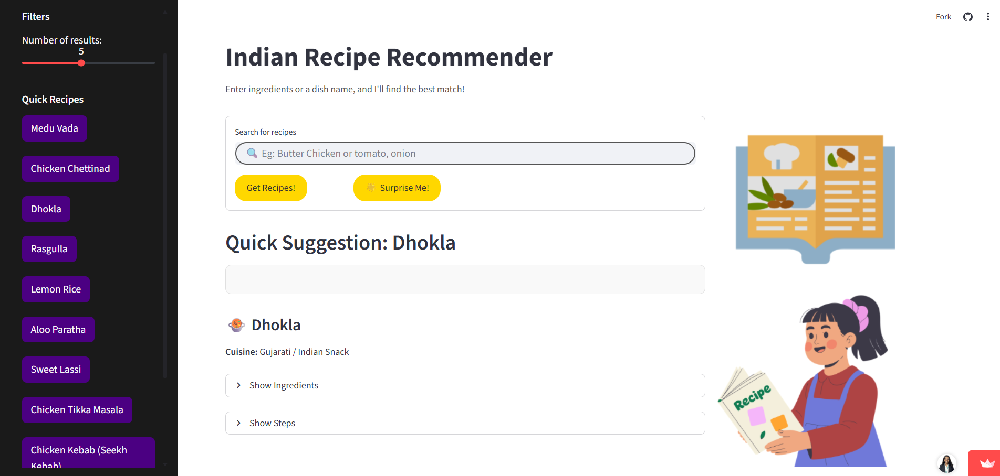

# Indian Recipe Recommendation Bot using NLP
**✅ Deployed App:** [Click here to try it out! 🍛](https://pragnyareddy00-recipe-recommendation-chatbot-using-n-app-gdfflu.streamlit.app/)

A Streamlit-based web application that recommends Indian recipes based on user input using Natural Language Processing (NLP) techniques. The app leverages TF-IDF vectorization and cosine similarity to find the best recipe matches from a dataset of Indian dishes.


## Features

- **Recipe Search**: Enter ingredients or dish names to get personalized recommendations.
- **Similarity Scoring**: Each recommendation includes a match score based on cosine similarity.
- **Quick Recipes**: Browse random quick suggestions from the dataset.
- **Surprise Me**: Get a random recipe recommendation.
- **Detailed Recipe View**: Expand to see full ingredients and step-by-step instructions.
- **Cuisine Filtering**: Recipes are categorized by Indian cuisines (e.g., North Indian, South Indian).
- **Interactive UI**: User-friendly interface with images and responsive design.

## Technologies Used

- **Python**: Core programming language.
- **Streamlit**: For building the web app.
- **Scikit-learn**: For TF-IDF vectorization and cosine similarity.
- **Pandas**: For data manipulation.
- **NLTK**: For text preprocessing (stopwords).
- **Pickle**: For loading pre-trained models and matrices.

## Installation

1. **Clone the Repository**:
   ```bash
   git clone https://github.com/pragnyareddy00/Recipe-Recommendation-Chatbot-using-NLP.git
   cd recipe-recommendation-bot
   ```

2. **Install Dependencies**:
   Ensure you have Python 3.7+ installed. Install the required packages using:
   ```bash
   pip install -r requirements.txt
   ```

3. **Download NLTK Data**:
   The app uses NLTK stopwords. Run the following in a Python shell:
   ```python
   import nltk
   nltk.download('stopwords')
   ```

## Usage

1. **Prepare Data and Models**:
   - Ensure the following files are in the project directory:
     - `cleaned_recipes.csv`: Cleaned dataset of recipes.
     - `vectorizer.pkl`: Pre-trained TF-IDF vectorizer.
     - `tfidf_matrix.pkl`: Pre-computed TF-IDF matrix.
     - `recipes.json`: JSON file with recipe details (optional, for reference).
   - Image files: `cookbook.png`, `girl.png`, `bg.png`, `word_cloud.png` (for UI).

2. **Run the App**:
   ```bash
   streamlit run app.py
   ```
   Open the provided URL (usually `http://localhost:8501`) in your browser.

3. **Interact with the App**:
   - Enter ingredients or a dish name in the search box.
   - Adjust the number of results using the sidebar slider.
   - Click "Get Recipes!" to see recommendations.
   - Use "Surprise Me!" for a random recipe.
   - Browse quick recipes in the sidebar.

## Data

- **Source**: The dataset includes a variety of Indian recipes with ingredients, steps, and cuisine types.
- **Preprocessing**: Recipes are cleaned and vectorized using TF-IDF for efficient similarity matching.
- **Note**: The app loads pre-processed data and models to ensure fast performance.

## Project Structure

```
recipe-recommendation-bot/
├── app.py                          # Main Streamlit application
├── cleaned_recipes.csv             # Preprocessed recipe data
├── recipes.json                    # Raw recipe data in JSON format
├── vectorizer.pkl                  # Pickled TF-IDF vectorizer
├── tfidf_matrix.pkl                # Pickled TF-IDF matrix
├── requirements.txt                # Python dependencies
├── TODO.md                         # Project tasks and notes
├── recipe_nlp.ipynb                # Jupyter notebook for NLP processing
├── cookbook.png                    # UI image
├── girl.png                        # UI image
├── bg.png                          # Background image
├── word_cloud.png                  # Word cloud visualization
└── README.md                       # This file
```

## Contributing

1. Fork the repository.
2. Create a feature branch: `git checkout -b feature-name`.
3. Commit changes: `git commit -m 'Add feature'`.
4. Push to the branch: `git push origin feature-name`.
5. Open a pull request.


## Acknowledgments

- Inspired by traditional Indian cuisine and NLP applications.
- Thanks to the open-source community for libraries like Streamlit and Scikit-learn.

## Connect me :
Email : gpragnyareddy1594@gmail.com
